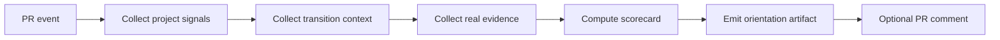

# Harmonic Temporal Orientation Implementation Map

> Map from the conceptual Harmonic Temporal Orientation model to concrete GitHub project artifacts and future automation hooks.

## Purpose

The whitepaper defines the model.
The playbook defines how to use it.
The decision log records decisions.
The scorecard evaluates transitions.

This implementation map explains how those pieces can fit into a GitHub workflow without immediately changing runtime or CI behavior.

---

## 1. Documentation package

| Artifact | Role | Current status |
| --- | --- | --- |
| `harmonic-temporal-orientation-system.md` | Theory and architecture | Drafted |
| `harmonic-temporal-orientation-playbook.md` | PR operating guide | Drafted |
| `harmonic-temporal-orientation-decision-log.md` | Append-only decision memory | Drafted |
| `harmonic-temporal-orientation-scorecard.md` | Transition scoring tool | Drafted |
| `harmonic-temporal-orientation-implementation-map.md` | This implementation map | Drafted |

---

## 2. Mapping model nodes to GitHub signals

| Model node | GitHub signal | Example evidence |
| --- | --- | --- |
| Project Graph | PR description, issue scope, protected protocol notes | Invariants, forbidden moves, merge rules |
| Transition Graph | Commits, comments, reruns, bot requests, baseline updates | Commit SHA, comment ID, workflow rerun ID |
| Real Graph | Checks, artifacts, bot comments, review outcomes | CI status, artifact ID, exact-head report |
| Orientation Center | Decision comment or decision-log entry | `allow`, `reject`, `hold`, `escalate` |
| Trajectory Graph | Ordered decision-log entries | `t0 -> t1 -> t2` decision chain |
| Observer Graph | Pattern notes in decision log | false transition, evidence debt, CI drift |
| Tuner Graph | Updated guardrails or scorecard rules | new rule, hard blocker, threshold change |

---

## 3. Recommended adoption phases

### Phase 0: Documentation-only

Current branch state.

```text
No runtime changes.
No CI changes.
No PR protocol mutation.
Only docs and examples.
```

### Phase 1: Manual orientation records

Before risky transitions, paste a short orientation record into the PR conversation or decision log.

Recommended for:

```text
baseline refreshes
seals
merge-readiness comments
large reverts
exact-head bot evidence checks
```

### Phase 2: Manual scorecard gate

Use the scorecard before applying a transition that can affect multiple invariants.

Recommended threshold:

```text
8-10: allow unless hard blocker exists
5-7: hold and collect more evidence
0-4: reject or redesign
```

### Phase 3: Lightweight CI reporting

Future optional automation can generate orientation summaries as artifacts.

Example artifact names:

```text
orientation-summary.json
transition-scorecard.json
observer-patterns.json
tuner-rules.json
```

### Phase 4: Advisory PR comment

A future workflow can post a non-blocking PR comment:

```text
Orientation decision: hold
Reason: trusted exact-head bot evidence is missing
Next allowed move: trigger AI cooperation report
```

### Phase 5: Blocking governance gate

Only after the model proves stable, selected hard blockers can become blocking CI.

Examples:

```text
No D6 without trusted exact-head report.
No merge-ready before accepted seal.
No baseline refresh without source artifact/run ID.
```

---

## 4. Minimal machine-readable orientation shape

Future tools can emit this JSON shape.

```json
{
  "schema": "harmonic-temporal-orientation/v1",
  "repo": "owner/repo",
  "pr": 0,
  "head_sha": "",
  "transition": {
    "type": "commit",
    "description": ""
  },
  "project_invariants": [],
  "hard_blockers": [],
  "evidence": {
    "green": [],
    "red": [],
    "missing": []
  },
  "score": {
    "project_invariant_alignment": 0,
    "side_effect_safety": 0,
    "evidence_path": 0,
    "exact_head_confidence": 0,
    "reversibility": 0,
    "total": 0
  },
  "decision": "hold",
  "next_allowed_move": "",
  "observer_notes": [],
  "tuner_rules": []
}
```

---

## 5. Future CI integration sketch

The first automation should be advisory only.



No branch protection should depend on the advisory output until the false-positive rate is understood.

---

## 6. Hard blocker candidates

These are good candidates for eventual automation because they are objective.

| Hard blocker | Required evidence |
| --- | --- |
| D6 seal before trusted report | Trusted exact-head bot report exists before seal |
| Merge-ready before ledger acceptance | Ledger/check status green after seal |
| Baseline refresh without artifact | Run ID and artifact/source metrics recorded |
| Bot evidence stale to head | Comment/check ties to exact current head SHA |
| Source-shape transition without traceability pass | Security and traceability checks pass after change |

---

## 7. Non-goals for first implementation

Do not start by building a blocking AI judge.

Do not start by mutating active repair PRs.

Do not replace human protocol decisions.

Do not treat the scorecard as truth.

The first implementation should be:

```text
observable
advisory
append-only
reversible
small
```

---

## 8. First useful automation candidate

The safest first automation is a script that reads a filled scorecard and validates only structural completeness.

Example command shape:

```text
node scripts/verify-orientation-scorecard.mjs docs/orientation-records/*.json
```

Initial checks:

```text
schema is known
head_sha is present when required
decision is allow/reject/hold/escalate
score total matches dimension values
hard blockers are listed when decision is hold/reject
```

This does not decide for the team. It only ensures the decision record is complete.

---

## 9. Implementation principle

```text
Automate evidence completeness before automating judgment.
```

The system should first help humans see the trajectory clearly. Only later should it enforce selected hard blockers.
