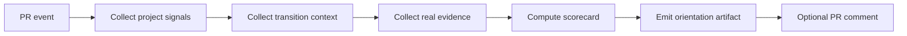

# Harmonic Temporal Orientation Implementation Map

> Map from the conceptual Harmonic Temporal Orientation model to concrete GitHub project artifacts and future automation hooks.

## Purpose

The whitepaper defines the model.
The playbook defines how to use it.
The decision log records decisions.
The scorecard evaluates transitions.

This implementation map explains how those pieces can fit into a GitHub workflow without immediately changing runtime or CI behavior.

---

## 1. Documentation package

| Artifact | Role | Current status |
| --- | --- | --- |
| `harmonic-temporal-orientation-system.md` | Theory and architecture | Drafted |
| `harmonic-temporal-orientation-playbook.md` | PR operating guide | Drafted |
| `harmonic-temporal-orientation-decision-log.md` | Append-only decision memory | Drafted |
| `harmonic-temporal-orientation-scorecard.md` | Transition scoring tool | Drafted |
| `harmonic-temporal-orientation-implementation-map.md` | This implementation map | Drafted |

---

## 2. Mapping model nodes to GitHub signals

| Model node | GitHub signal | Example evidence |
| --- | --- | --- |
| Project Graph | PR description, issue scope, protected protocol notes | Invariants, forbidden moves, merge rules |
| Transition Graph | Commits, comments, reruns, bot requests, baseline updates | Commit SHA, comment ID, workflow rerun ID |
| Real Graph | Checks, artifacts, bot comments, review outcomes | CI status, artifact ID, exact-head report |
| Orientation Center | Decision comment or decision-log entry | `allow`, `reject`, `hold`, `escalate` |
| Trajectory Graph | Ordered decision-log entries | `t0 -> t1 -> t2` decision chain |
| Observer Graph | Pattern notes in decision log | false transition, evidence debt, CI drift |
| Tuner Graph | Updated guardrails or scorecard rules | new rule, hard blocker, threshold change |

---

## 3. Recommended adoption phases

### Phase 0: Documentation-only

Current branch state.

```text
No runtime changes.
No CI enforcement changes.
No PR protocol mutation.
Only docs, examples, validator, and tests.
```

### Phase 1: Manual orientation records

Before risky transitions, create a canonical orientation record in the PR conversation or decision log.

Recommended for:

```text
baseline refreshes
seals
merge-readiness comments
large reverts
exact-head bot evidence checks
```

### Phase 2: Manual scorecard gate

Use the scorecard before applying a transition that can affect multiple invariants.

Recommended policy:

```text
8-10: allow unless a hard blocker exists
5-7: hold, reject, or escalate according to evidence and invariant conflict
0-4: hold when prerequisite evidence is missing; otherwise reject or escalate
```

### Phase 3: Lightweight CI reporting

Future optional automation can generate orientation summaries as artifacts.

Example artifact names:

```text
orientation-summary.json
transition-scorecard.json
observer-patterns.json
tuner-rules.json
```

### Phase 4: Advisory PR comment

A future workflow can post a non-blocking PR comment:

```text
Orientation decision: hold
Reason: trusted exact-head bot evidence is missing
Next allowed move: trigger AI cooperation report
```

### Phase 5: Blocking governance gate

Only after the model proves stable, selected hard blockers can become blocking CI.

Examples:

```text
No D6 without trusted exact-head report.
No merge-ready before accepted seal.
No baseline refresh without source artifact/run ID.
```

---

## 4. Canonical machine-readable orientation shape

The validator accepts the following top-level contract. This is not a future adapter shape; it is the current canonical record structure.

```json
{
  "id": "HTO-YYYYMMDD-001",
  "time_utc": "YYYY-MM-DDTHH:MM:SSZ",
  "repo": "owner/repo",
  "pr": "#000",
  "head_sha": "<exact-head-sha>",
  "actor": "human",
  "project_graph": {
    "invariant": ["What must remain true?"],
    "forbidden_moves": ["What must not happen?"]
  },
  "transition_graph": {
    "candidate": {
      "type": "commit",
      "description": "What transition is being considered?"
    },
    "expected_effect": ["What should improve?"]
  },
  "real_graph": {
    "evidence_before": {
      "green": [],
      "red": [],
      "missing": []
    },
    "evidence_after": {
      "green": [],
      "red": [],
      "missing": []
    }
  },
  "orientation_center": {
    "decision": "hold",
    "reason": "Why this decision was selected",
    "next_allowed_move": "What may happen next"
  },
  "observer_graph": {
    "pattern": [],
    "anomaly": [],
    "risk": []
  },
  "tuner_graph": {
    "rule_update": [],
    "threshold_update": []
  },
  "scorecard": {
    "scores": {
      "project_invariant_alignment": {"value": 0, "reason": ""},
      "side_effect_safety": {"value": 0, "reason": ""},
      "evidence_path": {"value": 0, "reason": ""},
      "exact_head_confidence": {"value": 0, "reason": ""},
      "reversibility": {"value": 0, "reason": ""}
    },
    "hard_blockers": [],
    "total": 0
  }
}
```

---

## 5. Future CI integration sketch

The first automation should be advisory only.



No branch protection should depend on the advisory output until the false-positive rate is understood.

---

## 6. Hard blocker candidates

These are good candidates for eventual automation because they are objective.

| Hard blocker | Required evidence |
| --- | --- |
| D6 seal before trusted report | Trusted exact-head bot report exists before seal |
| Merge-ready before ledger acceptance | Ledger/check status green after seal |
| Baseline refresh without artifact | Run ID and artifact/source metrics recorded |
| Bot evidence stale to head | Comment/check ties to exact current head SHA |
| Source-shape transition without traceability pass | Security and traceability checks pass after change |

---

## 7. Non-goals for first implementation

The first implementation does not build a blocking AI judge, mutate active repair PRs, replace human protocol decisions, or treat the scorecard as truth.

It should remain:

```text
observable
advisory
append-only
reversible
small
```

---

## 8. First useful automation candidate

The first automation is the validator already included in this branch. It reads canonical JSON records and checks structural completeness, score totals, decision values, evidence shape, blocker enum, and blocker precedence.

Validate the bundled valid records:

```bash
node scripts/validate-harmonic-orientation.mjs \
  docs/examples/harmonic-orientation-record.pr188-minify-reject.json \
  docs/examples/harmonic-orientation-record.pr188-baseline-allow.json \
  docs/examples/harmonic-orientation-record.pr186-d6-hold.json \
  docs/examples/harmonic-orientation-record.conflict-escalate.json
```

Run the positive and negative fixture contract:

```bash
node scripts/test-harmonic-orientation.mjs
```

Initial checks include:

```text
required top-level graph fields are present
orientation_center.decision is allow/reject/hold/escalate
score total matches dimension values
hard blockers use the canonical enum
hard blockers force hold or reject before escalation
malformed evidence and blocker types fail structurally
```

The validator does not decide for the team. It ensures that the recorded judgment is complete and internally consistent.

---

## 9. Implementation principle

```text
Automate evidence completeness before automating judgment.
```

The system should first help humans see the trajectory clearly. Only later should it enforce selected hard blockers.
