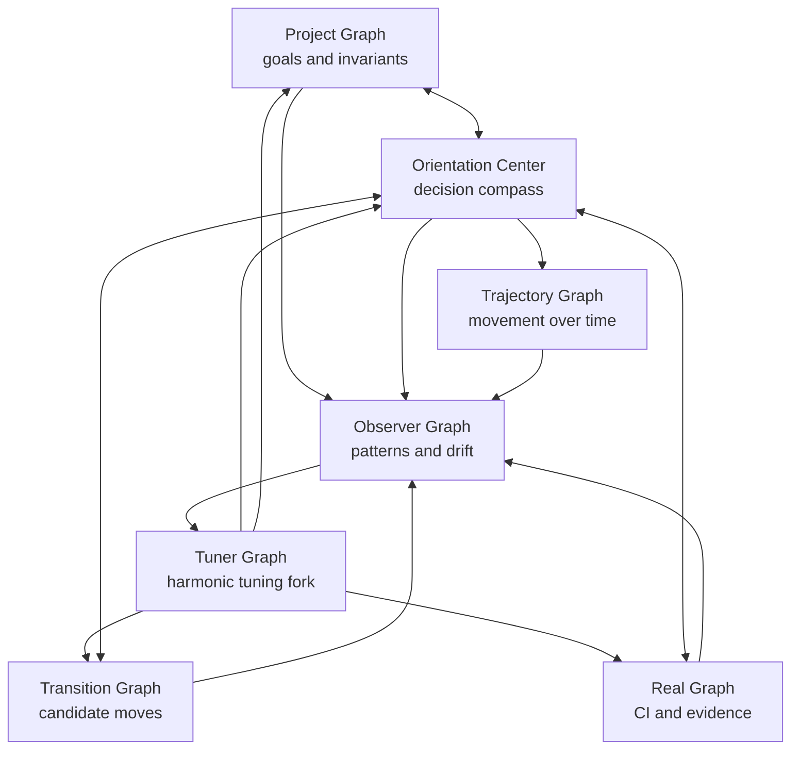
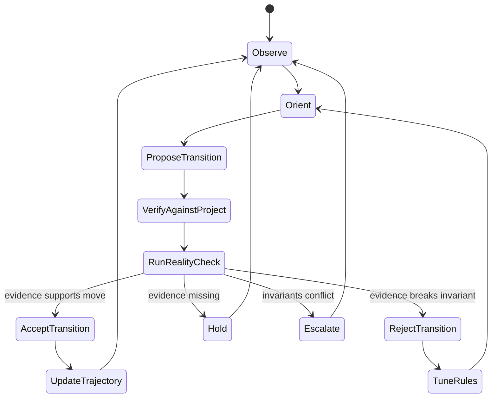

# Harmonic Temporal Orientation System

> Project navigation model for moving from intent to safe transition to verified reality.

## Purpose

This document captures the working model discovered while repairing CI and PR governance flows.

The system is designed to prevent shallow fixes such as chasing a red check without preserving the deeper project invariants. It separates what the project wants, what actions are being attempted, what reality has verified, and how the decision-making loop should be tuned over time.

## Core idea

A project should not move by the rule:

```text
red check -> quick fix -> hope CI passes
```

It should move by the rule:

```text
project invariant -> candidate transition -> real evidence -> orientation decision
```

The model is composed of seven cooperating graphs:

1. Project Graph
2. Transition Graph
3. Real Graph
4. Orientation Center
5. Trajectory Graph over time
6. Observer Graph
7. Tuner Graph / Harmonic Tuning Fork

---

## 1. Project Graph

The Project Graph describes what must remain true.

It contains goals, invariants, constraints, and forbidden moves.

Example invariants:

```text
PR must not be merged before exact-head evidence exists.
Security and traceability must not be broken to make a performance check green.
A baseline refresh must be evidence-backed, not arbitrary.
A D6 seal must not be posted before the trusted bot report exists.
```

The Project Graph answers:

```text
What are we protecting?
What must not be broken?
What does success actually mean?
```

---

## 2. Transition Graph

The Transition Graph describes candidate moves.

It contains actions such as commits, reruns, comments, baseline updates, report triggers, reversions, and escalation points.

A transition is not automatically valid just because it might make one check pass.

Each transition must be checked against:

```text
Does it move the project toward the invariant?
Does it break another invariant?
Can it be verified by real evidence?
```

Example:

```text
Lighthouse red -> minify JS
```

This transition looks reasonable locally, but can be rejected if it breaks readable source, security contracts, or traceability evidence.

---

## 3. Real Graph

The Real Graph records what has actually been verified.

It includes CI results, bot comments, artifacts, exact head SHAs, run IDs, review evidence, and observed failures.

The Real Graph answers:

```text
What is factually true right now?
Which checks are green?
Which checks are red?
Which evidence exists?
Which evidence is missing?
```

A transition is not accepted until the Real Graph confirms it.

---

## 4. Orientation Center

The Orientation Center is the decision node.

It sits between the Project Graph, Transition Graph, and Real Graph.

It receives:

```text
Project invariants
Candidate transitions
Real evidence
```

It outputs:

```text
accept transition
reject transition
hold / wait for evidence
escalate to human decision
```

### Orientation decision algorithm

```text
1. Read the project invariant.
2. Identify the candidate transition.
3. Check the current real evidence.
4. Ask whether the transition preserves all higher-priority invariants.
5. If yes, allow the transition.
6. If no, reject the transition.
7. If evidence is missing, hold.
8. If invariants conflict, escalate.
```

---

## 5. Trajectory Graph over time

The Trajectory Graph adds time.

It shows how the system moves from state to state:

```text
t0 -> t1 -> t2 -> t3 -> ... -> tN
```

At each time point, the Orientation Center recalculates:

```text
Where are we?
What is the next candidate move?
What did reality confirm?
What did reality reject?
What have we learned?
```

Example trajectory:

```text
t0: Lighthouse red
t1: candidate transition = minify JS
t2: Security and traceability turn red
t3: Observer detects false transition
t4: Tuner adjusts rule
t5: revert minify + refresh baseline from evidence
t6: checks are green and the rule is learned
```

---

## 6. Observer Graph

The Observer Graph watches the whole system without directly changing it.

It observes:

```text
patterns
anomalies
false transitions
repeated mistakes
evidence debt
CI drift
decision drift
```

The Observer does not decide the next move. It notices what is happening.

Example observations:

```text
We tried to fix a red performance check directly.
The attempted fix broke security and traceability.
The red check was a stale baseline issue, not a runtime correctness issue.
```

The Observer produces system memory.

---

## 7. Tuner Graph / Harmonic Tuning Fork

The Tuner Graph adjusts the decision rules.

It is the harmonic tuning fork of the system.

It asks:

```text
Are the project goals still aligned?
Are transitions preserving harmony between checks?
Are evidence thresholds correct?
Are we moving forward or looping?
Is the cost of the transition higher than its benefit?
```

The Tuner updates:

```text
decision rules
transition permissions
evidence thresholds
baseline policy
human escalation boundaries
```

Example tuning rule:

```text
Readable traceable source is more important than artificial JavaScript shrinking when security and traceability contracts depend on source tokens.
```

---

## Full model



---

## State machine



---

## Practical PR protocol

For each PR, use this checklist.

### Project Graph

```text
What invariant does this PR protect or change?
What must not be touched?
What would make this PR unsafe even if CI is green?
```

### Transition Graph

```text
What transition are we about to perform?
Is it a code change, CI rerun, bot trigger, baseline refresh, seal, merge action, or escalation?
```

### Real Graph

```text
What exact evidence exists?
What head SHA is verified?
Which bot posted the evidence?
Which run ID or artifact proves the claim?
```

### Orientation Center

```text
Allow, reject, hold, or escalate?
```

### Observer

```text
What pattern did this reveal?
Did we chase a symptom?
Did a local fix damage a global invariant?
```

### Tuner

```text
What rule should be updated so the next transition is cleaner?
```

---

## Example: performance baseline decision

Bad local transition:

```text
Lighthouse red -> minify JS
```

Observed result:

```text
Security red
Traceability red
Lighthouse still red
```

Tuner rule:

```text
Do not reduce source readability when evidence contracts depend on exact source tokens.
```

Clean transition:

```text
restore readable runtime -> refresh Lighthouse baseline from CI evidence
```

Accepted only when:

```text
Security green
Traceability green
Lighthouse green
Adversarial green
CodeQL green
```

---

## Example: merge readiness decision

Before posting a final merge command, the Orientation Center must verify:

```text
exact head SHA is known
required bot evidence exists
trusted bot identity matches expectation
seal order is correct
ledger/checks are green
no protected invariant is missing
```

If any evidence is missing:

```text
hold, do not merge
```

---

## Summary

This model turns project work from reactive fixing into guided navigation.

```text
Project Graph = what must remain true
Transition Graph = how we try to move
Real Graph = what evidence confirms
Orientation Center = what move is allowed now
Trajectory Graph = how state changes over time
Observer Graph = what patterns are noticed
Tuner Graph = how the system becomes wiser
```

The goal is not just green CI.

The goal is a coherent project trajectory where each transition is safe, meaningful, evidence-backed, and harmonized with the whole system.
