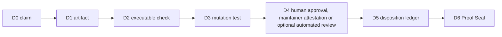

# PDG-001 Proof Depth Graph

A green check is not proof. Proof exists only when a complete exact-head path reaches a sealed decision.

PDG-001 applies the ClewAI ideas of ProofPath, CML, LTP and Verified Episode to pull-request readiness.

## Depth

| Depth | Stage |
|---:|---|
| D0 | Claim |
| D1 | Repository artifact |
| D2 | Executable verification |
| D3 | Mutation challenge |
| D4 | Exact-head independent review |
| D5 | Finding disposition |
| D6 | Maintainer Proof Seal |

## Required review graph



The binding authority is provider-neutral. A repository maintainer owns the decision; optional automated reviewers such as Codex or GitHub security tools may add evidence but cannot receive merge authority.

D4 accepts one of these exact-head evidence forms:

1. a trusted human `APPROVED` review bound to the current commit;
2. a trusted top-level maintainer attestation:

```text
Independent-Review: PDG-001
Head: <exact 40-character commit SHA>
Outcome: accepted
```

3. optional exact-head automated review evidence from a configured non-binding reviewer.

A solo maintainer may use the existing exact-head `/merge-ready <SHA>` attestation as the D4 statement. This is explicit accountable intent, not a claim of external independence.

The executable graph is `qa/proof-depth-graph.json`.

Validation commands are `npm run verify:proof-depth` and `npm run test:proof-depth`.

## D5 dispositions

Inline review findings use a maintainer reply containing `Disposition`, `Head`, and any supporting evidence required by the chosen disposition.

When an optional automated reviewer publishes a current-head P0-P3 finding as a top-level PR issue comment, disposition it with a later trusted top-level comment containing:

- `Disposition-For-Issue-Comment: <GitHub comment ID>`
- `Disposition: accepted`, `rejected-with-evidence`, or `superseded`
- `Head: <exact 40-character commit SHA>`

An older comment edited after the finding is not accepted as a fresh disposition.

## Proof Seal

A proof seal contains these three lines:

- `Proof-Depth-Seal: PDG-001`
- `Head: <exact 40-character commit SHA>`
- `Depth: D6`

A seal is valid only when:

1. it names the current PR head;
2. exact-head D4 evidence exists;
3. all current-head findings from configured optional reviewers have explicit dispositions;
4. required CI, mutation tests and human authorization pass;
5. the seal was posted after the latest evidence and dispositions.

A new commit or later finding invalidates the seal. Inferred graph edges remain advisory and cannot grant readiness authority. No external AI provider, quota state or provider-specific workflow is required for release.
