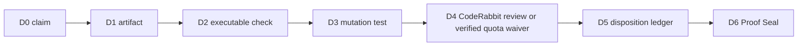

# PDG-001 Proof Depth Graph

A green check is not proof. Proof exists only when a complete exact-head path reaches a sealed decision.

PDG-001 applies the ClewAI ideas of ProofPath, CML, LTP and Verified Episode to pull-request readiness.

## Depth

| Depth | Stage |
|---:|---|
| D0 | Claim |
| D1 | Repository artifact |
| D2 | Executable verification |
| D3 | Mutation challenge |
| D4 | Independent CodeRabbit outcome |
| D5 | Finding disposition |
| D6 | Maintainer Proof Seal |

## Required review graph

The binding AI reviewer is **CodeRabbit**. Codex, DeepSeek and Jules are advisory. Qodo is disabled.

Normal D4 evidence is an authenticated request-bound CodeRabbit exact-head review at E4 or E5. A verified post-request `QUOTA_EXHAUSTED` signal may occupy D4 only as a provider-limit waiver. The waiver explicitly does not claim that a review occurred and cannot remove D5, D6, required CI or human authorization.

The executable graph is `qa/proof-depth-graph.json`.

Validation commands are `npm run verify:proof-depth` and `npm run test:proof-depth`.

## D5 dispositions

Inline review findings use a maintainer reply containing `Disposition`, `Head`, and any supporting evidence required by the chosen disposition.

When an authenticated reviewer publishes a current-head P0-P3 finding as a top-level PR issue comment, disposition it with a later trusted top-level comment containing:

- `Disposition-For-Issue-Comment: <GitHub comment ID>`
- `Disposition: accepted`, `rejected-with-evidence`, or `superseded`
- `Head: <exact 40-character commit SHA>`

An older comment edited after the finding is not accepted as a fresh disposition.

## Proof Seal

A proof seal contains these three lines:

- `Proof-Depth-Seal: PDG-001`
- `Head: <exact 40-character commit SHA>`
- `Depth: D6`

A seal is valid only when:

1. it names the current PR head;
2. CodeRabbit has current-head E4/E5 evidence, or a verified request-bound `QUOTA_EXHAUSTED` waiver is recorded without claiming review completion;
3. all current-head findings from CodeRabbit and any available advisory reviewer have explicit dispositions;
4. required CI, mutation tests and human approval pass;
5. the cooperation report is `READY` or `READY_WITH_ADVISORY_GAPS` for the same head;
6. the seal was posted after the latest evidence and dispositions.

A new commit or later finding invalidates the seal. Inferred graph edges remain advisory and cannot grant readiness authority.
