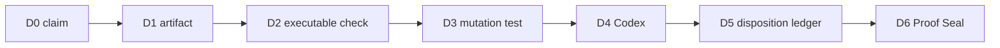

# PDG-001 Proof Depth Graph

A green check is not proof. Proof exists only when a complete exact-head path reaches a sealed decision.

PDG-001 applies the ClewAI ideas of ProofPath, CML, LTP and Verified Episode to pull-request readiness.

## Depth

| Depth | Stage |
|---:|---|
| D0 | Claim |
| D1 | Repository artifact |
| D2 | Executable verification |
| D3 | Mutation challenge |
| D4 | Independent exact-head review |
| D5 | Finding disposition |
| D6 | Maintainer Proof Seal |

## Required review graph

The binding reviewer is **Codex**. CodeRabbit is a scheduled advisory reserve. Its authenticated current-head findings must be dispositioned when present, but provider absence does not block readiness. DeepSeek and Jules are optional advisory lanes. Qodo is disabled.

The executable graph is `qa/proof-depth-graph.json`.

Validation commands are `npm run verify:proof-depth` and `npm run test:proof-depth`.

## Proof Seal

A proof seal contains these three lines:

- `Proof-Depth-Seal: PDG-001`
- `Head: <exact 40-character commit SHA>`
- `Depth: D6`

A seal is valid only when:

1. it names the current PR head;
2. Codex has current-head evidence at cooperation evidence level E4 or E5;
3. all current-head findings from Codex and any available advisory reviewer have explicit dispositions;
4. required CI and mutation tests pass;
5. the seal was posted after the latest evidence and dispositions.

A new commit or later finding invalidates the seal. Inferred graph edges remain advisory and cannot grant readiness authority.
