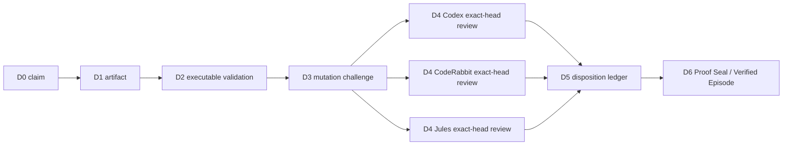

# PDG-001 Proof Depth Graph

A green node is not proof. Only a complete, current-head path from a claim to a sealed decision is proof.

`PDG-001` brings the ClewAI / Liminal ideas into the repository review flow:

- **ProofPath** — do not authorize an action until the evidence path is complete;
- **CML** — record why a decision is allowed, not only that a check passed;
- **LTP** — keep the reasoning path replayable across state changes;
- **Verified Episode** — seal one exact commit only after evidence and dispositions are complete;
- **graph learning rule** — inferred edges remain advisory and never gain execution or merge authority.

## Depth model

| Depth | Stage | Question |
|---:|---|---|
| D0 | Claim | What are we claiming? |
| D1 | Artifact | What repository evidence represents the claim? |
| D2 | Executable check | What code verifies the artifact? |
| D3 | Mutation challenge | Does the check reject a deliberately broken case? |
| D4 | Independent review | Did independent reviewers inspect this exact head? |
| D5 | Disposition | Was every finding accepted, rejected with evidence, or superseded? |
| D6 | Proof seal | Did a maintainer seal the completed path after the latest evidence? |

A merge/readiness claim is invalid when any depth is missing, skipped, stale, disconnected, dependent on a single reviewer, or based on an inferred binding edge.

## Graph



The executable source of truth is `qa/proof-depth-graph.json`. Validate it with:

```bash
npm run verify:proof-depth
npm run test:proof-depth
```

## Proof Seal

The final runtime gate requires a trusted maintainer comment in this exact format:

```text
Proof-Depth-Seal: PDG-001
Head: <exact 40-character commit SHA>
Depth: D6
```

The seal is valid only when:

1. it names the current PR head;
2. it was posted after the latest exact-head bot review evidence;
3. Codex, CodeRabbit and Jules supplied independent current-head evidence;
4. every current-head finding has an explicit maintainer disposition;
5. all required executable checks are complete and successful;
6. the static PDG graph and its mutation tests pass.

A new commit invalidates the old seal. A new current-head finding posted after the seal also invalidates it. The maintainer must resolve the new evidence and create a new seal.

## Why this prevents false green

The earlier gate could become green when it observed zero findings before reviewers finished. PDG-001 treats that as an incomplete path at D4, not success. The system reaches D6 only after reviewers have produced current-head evidence, findings have dispositions, and a maintainer seals the final replayable state.

This is the repository version of a ClewAI stored route of understanding:

```text
claim -> evidence -> executable verification -> attempted falsification
      -> independent causal review -> disposition -> sealed decision
```

The decision is causal, not a vote. Three green bots cannot override a broken executable check, and one green check cannot replace independent evidence.
