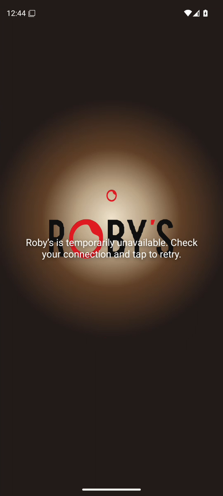
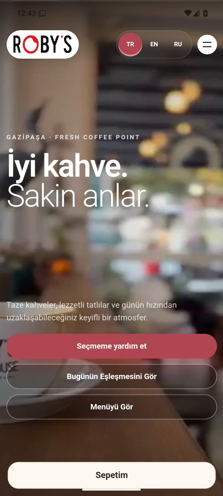

# Android cache-safe candidate: rejected on native launch

Run [34227119767](https://github.com/safal207/robys-coffee-house-demo/actions/runs/34227119767)
does not justify promoting the isolated Android candidate into PR #346. The
candidate receives its new module but times out before revealing the product.
The control's successful fallback also conceals a substantial visible delay.

## Fixed comparison

| Role | Immutable commit | Web inventory |
| --- | --- | --- |
| Tooling | `7d644c36f2c6bf7c4dffa8aa436110ec9fc2df58` | Workflow and collector |
| Control | `7ca13b9adbf45b953c3b0997107d010e7bad1d9b` | 240 files |
| Candidate | `c9a9d9c5feeb35d8b6077485b537ab3b60f62b67` | 241 files |
| Unmodified PR #346 | `7799f80b5a6561beec57f2d98f8e8ca58e8c36fa` | Candidate remains outside PR |

Each arm is one cold launch on API 36 / WebView 133.0.6943.137, with the same
software renderer, 120-second idle interval, original capture assertions and
deadlines, system trace and declared internal rendering observer. Native Java
is identical between subjects. APK-local resource interception pins web bytes
and blocks external requests. This is an instrumented experiment, not a
physical-device or public-site release test.

This comparison tests the combined product-frame candidate against the control.
It does not isolate the filename change from the earlier candidate, estimate a
general speedup, or test upgrade from an installed old service worker. The
separate browser upgrade evidence remains bounded to that browser experiment.

## Observed result

| Evidence | Control | Candidate |
| --- | --- | --- |
| Original native verdict | PASS through fallback | FAIL |
| `WEB_READY` observed | No | No |
| Native surface to outcome | Completion at 8,675.786 ms | Visual-state timeout at 12,563.855 ms |
| Post-completion trace window | Full 10 seconds captured | Not applicable: no completion |
| Recorded boundary pixels | First uncovered product in reviewed sequence 6,243.425 ms after completion | Terminal retry error; no completed handoff |

The candidate's new `android-native-product-frame.js` was served at 2,128.217 ms
after the native surface with SHA-256
`b3fc17389457337e465cb93223907b2d6f2f4b98add0a2925176a80c9927f71f`.
Delivery proves resource bytes, not module execution: worker precaching can
also cause a request. There is no module-specific execution marker.

The candidate has a 6,551.262 ms draw earlier in startup, another 2,573.370 ms
draw ending 426.006 ms before failure, and a 1,280.994 ms draw crossing the
failure marker from -14.263 to +1,266.730 ms. These intervals establish stalls,
not an exclusive DOM or shader cause.

The control has a 6,121.626 ms draw spanning -22.768 to +6,098.858 ms relative
to completion and a second 1,413.683 ms draw from +6,622.158 to +8,035.841 ms.
Inclusive parent/child wall times are not added; wall time is not CPU time.

## Pixel verification

Winscope v2 embedded timestamps agree with decoded MP4 PTS within one 90 kHz
tick. Control frame 43 (PTS 15.427978 s) still shows the splash; frame 44
(PTS 15.454422 s) first shows the uncovered product in the reviewed boundary
sequence, 6,243.425 ms after the
completion marker. That encoded frame remains until frame 45, 1.801534 s later.
The recording continues beyond completion plus ten seconds.

Candidate frame 60 (PTS 16.215411 s) still shows the splash; frame 61
(PTS 16.562856 s) shows the retry error, 1,664.556 ms after the failure marker.
The final reviewed frame 160 (PTS 40.329611 s) still shows that error. Encoded
video timing is not physical-display presentation timing. The generic
connection advice in the error screen does not establish a network cause.

## Provenance and limits

Both downloaded ZIPs pass SHA-256 and CRC verification. Reconstruction from
immutable committed preparation code matches 27 archived files/bindings per arm
and all 13 diagnostic tool hashes. Both web inventories and served-resource
hashes match. APK hashes and inventories are consistent CI records; the APK
itself is not uploaded, so this is not an independent local APK reconstruction.

| Artifact | ID | Downloaded ZIP SHA-256 |
| --- | --- | --- |
| Candidate | 10056463821 | `8d31f86ff009cac06b25847caeca2c065a82052336967e39ef4b6cfbf6adf17a` |
| Control | 10056456978 | `62a03e9dd923e6283377348daa534e9d0fa873b73f42b233a22ac7ef87ba1c04` |

Queried system-trace error/data-loss rows are empty. Both internal streams
close with matching byte counts and zero recorded I/O errors: candidate
13,231,310 bytes; control 12,213,154 bytes. Internal first events begin
153.458 / 103.997 ms after the native surface, so full internal startup coverage
is not claimed. System outcome windows are complete. Control internal events
span its full post-completion window. Incomplete tails and one tiny nesting
crossing per arm remain explicit in the JSON; stripped arguments prevent
exclusive operation attribution. Closed output does not prove every event was
recorded or exclude buffer limitations.

Replay tools are `scripts/qa/verify-cache-probe-artifacts.py`,
`scripts/qa/android-cache-reveal-analysis.sql` and
`scripts/qa/parse-android-video-clock.py`. Per-arm provenance, trace results and
selected-frame timestamps/hashes are in `qa/evidence/android-cache-20260908/`.
The verifier requires the original ZIP digest and immutable subject checkout;
it never executes code from the artifact. The previous authentic control ZIP
is rejected because its workflow binding belongs to an earlier run.

Absolute scratch paths inside the trace summary are acquisition records.
The included portable replay tools cover ZIP provenance, system SQL and video
clock parsing; they do not reproduce the additional internal-rendering analyzer
whose file hashes and limits are retained in the summary.

## Decision and continuation

Keep c9a9d9c5 outside PR #346. Do not extend deadlines or treat fallback logs as
proof of a visible menu. The cache-specific browser fix does not repair this
native failure. The next causal gap is the readiness dependency/poll sequence
and its relationship to the subsequent product draw; observe those stages
before proposing another native repair. Repeating this pair without a new
hypothesis would not close that gap.

The current web PR was rechecked without changes: `npm run check` and
`npm run verify:security` pass (287 security contracts plus secret scan).
The PR remains unmerged, with its existing native failure and required
maintainer attestation unresolved. No production or APK deployment occurred.
