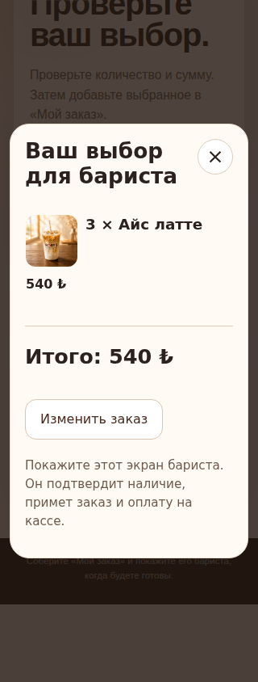
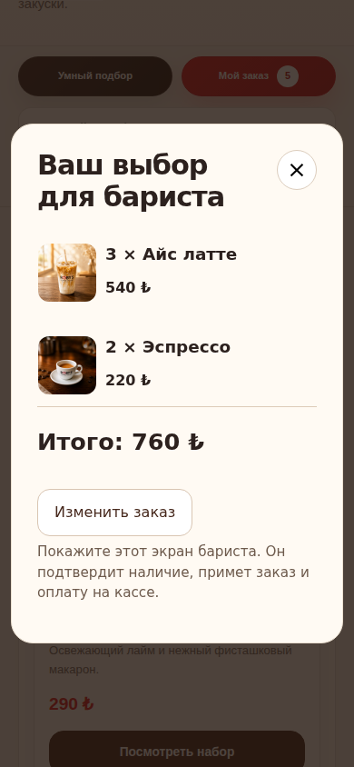

# PR #346: complete guest journey verification

The acceptance boundary is a correctly priced, editable selection that survives
moving between guided choice and the menu, and ends in a readable barista view.
The product contract and eight causal findings are in
[the journey note](../product/guest-journey-2026-09-07.md).

## Source and evidence

The base is `e3edcf13de323c3adb80c9c96465f1dd0425eee0`. The integration contains
the shared-order work from #341, selected pairing work from #342, and preserves
the deployed takeaway cup from #343. It does not merge Android diagnostic work.

| Evidence | Tested commit | Run / artifact | Artifact SHA-256 |
| --- | --- | --- | --- |
| Initial complete flow | `3e9790ada945f1a76795d1e15b5816a9bd3d20c5` | 34137256731 / 10024543003 | `6b1d24ac0e643ab005cecfbae8dfbce53186c82af34726612d53b25e1fbfd994` |
| Settled screenshots and common-order checks | `0b7f500380dd6e21efd07706c3b8dc13bb6bb303` | 34138794036 / 10025144480 | `b222da6efcb29f9131d8eeb4259af7651ac9f4ac4ee27ebc6fa3438628d0a3fe` |
| Visual comparison used for inspection | `ee3ebface9430f340bce39b3ff35badd3ae388b8` | 34140015761 / 10025678130 | `f1f043717fce5dccd5d6421e32c150ef7b6ab0b457850d583a4b8888acf05358` |
| Complete flow with delayed drawer cancellation | `ee3ebface9430f340bce39b3ff35badd3ae388b8` | 34140015759 / 10025588009 | `bde46e1c717856bb586638188856ff708c382b2d13efa9db7d14d13c756eb792` |

These are candidate-specific observations, not claims that a later commit was
executed. The final PR checks must validate the final commit before release.
All downloaded archives above were verified against their recorded digests.

## Functional coverage and repairs

- The domain matrix checks 2,160 production-catalog inputs in TR/EN/RU for
  1–4 guests and 2,592 returned choices. Quantity, budget, canonical item prices,
  editor totals, atomic order addition and reload agree. Insufficient budgets
  and incompatible preferences intentionally retain actionable no-match states.
- The browser flow passes all 12 language/count/viewport combinations: TR/EN/RU,
  two/three guests, 320/390px. It exercises ordinary input, optional-addition
  decline, the barista screen, repeat-add/reload protection, menu continuation,
  quantity changes, removal/undo and global search. Pairing coverage passes
  24 configurations, with negative controls for obscured and broken imagery.
- Three inherited browser checks initially targeted the retired menu-only
  dialog. They now inspect the common dialog while retaining amount, quantity,
  focus, live-region and target-size assertions. A real late-import race then
  appeared: Escape could arrive before the drawer existed. Cancellation now
  persists through loading; opening a product or another order entry supersedes
  a pending open. Both menu and floating order controls share that cancellation
  event. The final browser test delays both entry paths explicitly.
- A cold splash hold measured 233.4ms on candidate `0b7f500`, below its unchanged
  250ms minimum. The reading pause now starts after the entrance animation
  finishes. Normal cold/warm durations remain 1,530/600ms in the clock contract;
  delayed and stalled animation cases preserve the pause or release at the hard
  stop. All 22 lifecycle cases pass. Motion depth and feedback browser checks
  passed on `ee3ebfa` after these repairs.
- Full `npm run check` and `npm run verify:security` passed before candidate
  publication, including 287 security checks and source/generated-byte parity.
  The cache contract rejects old query revisions for ten order/choice/pairing
  assets and accepts exact cached offline matches. This VM cache contract is
  not a two-version browser service-worker upgrade certification.

## Visual inspection

The original comparator preserves **24 differences out of 43**. The complete
comparison results on `3e9790a`, `0b7f500` and `ee3ebfa` are identical; none is relabelled
as a raw pixel-match pass. The existing #341 record covers different bytes and
cannot authorize this integration.

| Changed area | Count | Supported explanation |
| --- | ---: | --- |
| Landing and Discover full pages, four widths each | 8 | The shared order adds 96px of bottom clearance. Existing content and representative top/footer captures remain readable. |
| Menu full pages, four widths | 4 | Full pairing images, separate copy/prices/actions and responsive columns change document height, plus the same order clearance. All 63 products remain in the source and menu checks. |
| Hero, four widths | 4 | Measured space for the order control and primary actions; the 360px short hero grows from 640 to 713px. Ordinary-action clearance is tested separately. |
| Discover pairing, tablet and desktop | 2 | The fixed order control appears at its real initial-viewport position in the document crop. It is not masked. The pairing actions are independently activated. |
| Menu share, five widths | 5 | Pairing reflow changes document Y and its fractional raster phase. Relative child geometry, content, dimensions, fonts and colours match. |
| Social offer, short phone | 1 | The same fractional-origin change documented in #341; geometry, content and styles are unchanged. |

Inspection includes full pairing compositions at 320/390/768/1440, the short
hero, representative landing/Discover top and footer crops, share comparisons,
and settled order/barista screenshots. Geometry evidence supports the remaining
widths; this is not an exhaustive physical-device visual review.

The supplemental record binds the current renderer, source, styles, build,
comparison configuration and this frozen summary. Ratio ceilings equal the
observed ratios, with exact pixel counts; dimension-mismatch reasons must match
exactly. It grants no general tolerance to future edits. No baseline, new mask,
global threshold, security policy or performance budget is changed.

Since the captured `ee3ebfa` rendering, runtime edits only extend deferred-order
intent cancellation to the floating launcher and superseding product selections.
These edits are included in the content bindings and must pass a fresh comparison
on the final PR commit. The unchanged verifier accepts the retained metrics and
rejects both an extra failed comparison and one additional changed share pixel.
This record is an assistant's
source and visual inspection, **not human maintainer approval or release
authorization**.

The retained examples below are unmodified CI screenshots from `ee3ebfa`:

## Cadence measurement repair

On `0e329a1`, the complete order, shared-order regression, responsive UI,
accessibility, scrolling, screenshot review and performance checks passed. Three
jobs still failed the shared entrance-cadence assertion (3–4 repeated frames).
Their original startup frames were not saved before the assertion, so an isolated
branch added instrumentation without changing any public runtime bytes.

Diagnostic `a1525a323acedce98a39d789037871111b2f6a65`, run 34141548289,
artifact 10026121848 (`3fdd253b2321217b866bacea5d6b6d9444f4ab5225cd78b03d022199ab2f31d9`)
preserved 18 completed cold starts. Four reproduce the cadence failure: three
initial samples have opacity **0**, animation time **0**, and `pending=true`.
After startup, every retained trace has 24 distinct transforms, no repeated
visible frame, and a 16.7ms median interval. Observed startup spans are 33–84ms.
The nineteenth navigation timed out; this diagnostic is **not a 20/20 pass**.
The shared HTTP helper had an unread stderr pipe; it now drains it while retaining
a bounded log tail, so a long matrix cannot fill that pipe and block responses.

The cadence check retains every raw sample and separates only the initial
invisible pending phase. It requires a visible start within **150ms**, then the
same **24** consecutive samples, **20** distinct transforms/changes, maximum
**two** identical frames and **20.5ms** median interval. It never removes samples
after the first visible frame. Existing total-duration, readable-hold and fade
requirements remain. Seven local cases replay the retained trace and reject an
injected visible freeze, opacity reversal, slow cadence, delayed/absent start and
missing samples. The fixture is `qa/evidence/pr-346-motion-startup-probe.json`.

Morning/Day/Night suites now save raw probes before assertions. This is a repair
to the measured phase, not a claim that the failed jobs passed or a relaxation of
the visible-animation limits. Fresh CI on the final PR commit is still required.

The corrected diagnostic `a0291ba07246c263d5c3b06c8e9fb53c0313567b` completed
**20/20** cold starts with the unchanged public runtime, passing brand, total
timing and the corrected phase measurements. Visible startup was 39.4–136.9ms.
Run 34142132961, artifact 10026309902 has verified archive SHA-256
`67eefee44ef0a8248ce9fa3dc5c55db5a5ad660f49cbb57a27f7cd39bf80ed0d`.
The diagnostic workflow remains on its isolated QA branch and is not shipped in
the product PR. The reusable raw recording, bounded server log and seven
negative-control/replay cases are included in the PR's normal checks.

## Remaining boundaries

Candidate `0b7f500` failed the sealed performance gate: one measured mobile
Lighthouse run had TBT 3,107ms; the median was 2.5ms. Its raw report attributes a
3,859ms task to “Unattributable”; that does not identify a product-code cause.
The result is retained, not discarded or called a pass. The fresh six-measurement
mobile/desktop evidence on `ee3ebfa` passed the unchanged release gate in run
34140015745. Final-commit performance remains a separate required check.

Local browser preview was blocked by automatic environment permission review;
the browser evidence here comes from CI. No physical Android device, deployed
version, real payment, accepted café order, revenue uplift or customer-emotion
outcome is certified by these tests. Android API 36 remains #345; QR transfer and
POS acknowledgement remain #340/#259; price ownership remains #299/#300. A
barista view is a handoff attempt. The guest must still show it at the counter.
