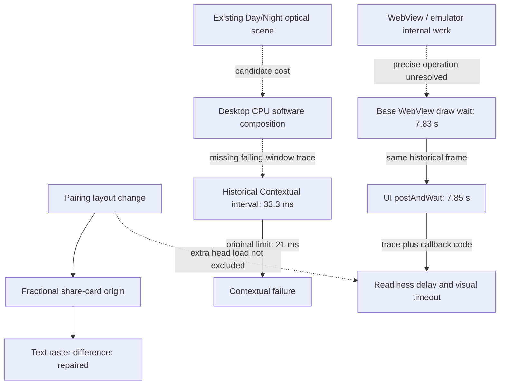

# PR #342 causal graph and finding

Observed CI subject: `995ff5f795da4bb8e2220d1c6dd4f069100b08ef`.
Exact base: `5b01276b99db719cae2fc72f29d38eb00c9953f4`.
Initial audit head was `0eeee89db2d7704bde7bc7c84c72b213ca0f5077`.
The new head adds a diagnostic trace and this report only. Product bytes,
native deadlines, visual thresholds and existing 251 review bindings are unchanged.

**There is no established single root cause for the three test families.**
Pairing caused the bounded share-capture raster defect, which is repaired.
The inherited Android render-wait mechanism is confirmed. Contextual's internal
bottleneck remains a candidate: the new local trace points to CPU composition,
but both CI attempts passed and did not execute the failure-only trace.
The absence of a failing CI sample trace is an explicit evidence gap.

Solid edges have controlled-change, code or trace support within their stated
scope. Dotted edges remain hypotheses. Android durations belong to the historical
immutable base, not the current-head launch. Desktop SoftwareRenderer and Android
WebView/emulator rendering are different paths; no shared driver fault is established.

## Findings and causal limits

| Finding | Strongest supported claim | Evidence / boundary |
| --- | --- | --- |
| CG-01 share raster | Confirmed cause: fractional crop origin changes text rasterization | Six actual base/head crop pairs become pixel-equal after symmetric alignment; 13 controls retain genuine-change rejection and error restoration |
| CG-02 menu heights | Intentional pairing layout difference | Four exact inspected dimensions; existing content-bound review record, without a new allowance or human-approval claim |
| CG-03 Contextual | Inherited failure supported; CPU composition is the leading internal candidate | Earlier original Day failure at 33.3 ms; all 46 observed scene resource paths equal base; the new local trace is a passing observation |
| CG-04 Android | Historical render wait blocks UI and delays readiness handling | Exact-base drawGl 7833.854 ms and UI wait 7847.235 ms; current pinned base/head also fail, but their internal waits were not traced here |
| CG-05 surface hints | Neither hint is a demonstrated repair | Back faces 7/8 versus 8/8 controls; isolation 6/8 versus 5/8; both original gates failed and both product candidates were removed |
| CG-06 landing paint | Separate unresolved historical capture variance | One older landing capture omitted map/promotion paint on source-identical files; the share-origin repair does not explain this omission |

Source identity alone does not exclude indirect load. The contextual 46-path
identity control and Android pinned-delivery verifier provide separate evidence.
Pairing is not necessary for the base Android failure; extra head precache load
remains a possible amplifier. These observations do not estimate failure frequency.

## New local Chromium trace

The collector imports the original gate prefix and inserts two User Timing marks
around its unchanged 18-sample loop. Removing them must reproduce the original
functions exactly. The two cold launches and scene assertions remain intact.
Draining HTTP server pipes is an explicit diagnostic plumbing difference.
Tracing introduces observation overhead.

The final local run used Chromium 140.0.7339.186. Both scene medians were 16.7 ms.
GPU compositing and rasterization report `disabled_software`; actual traced work
is `SoftwareRenderer::DoDrawQuad` on `VizCompositorThread`. A SwiftShader device
label does not mean these draws use a GPU compositor.

| Local sample window | Window length | Main-thread CPU | Display draw CPU, 16 complete slices | Median display draw CPU | Median animation callback wall time |
| --- | --- | --- | --- | --- | --- |
| Day | 316.991 ms | 23.702 ms | 293.646 ms | 18.001 ms | 0.307 ms |
| Night | 333.889 ms | 25.194 ms | 309.623 ms | 19.382 ms | 0.286 ms |

Display sums exclude two boundary-crossing slices per scene. Nested categories
overlap and must not be added together. Main-thread CPU covers the whole marked
interval; callbacks cover complete slices within it. All four marks, 18 samples
per scene, trace/probe/derived hashes and no reported data loss were verified.
Display totals and medians were independently recomputed from raw events in Python.

This locates substantial CPU composition cost in a **local passing run** and
weakens a dominant JavaScript-callback explanation there. It does not establish
what delayed the earlier failing CI frames. The gate measures animation callback
intervals; display CPU time is diagnostic and must not replace that metric.

Earlier bounded optical ablations passed 4/4 observations after removing shadows,
filters or perspective, versus 1/4 unchanged. This supports scene rendering cost
as a candidate, without ranking those effects or approving their removal.
The backface/isolation candidates did not reproduce a repair.

## Current CI observations on 995ff5f

| Check | Result | Evidence boundary |
| --- | --- | --- |
| Pairing, run 34110417334 | PASS, 24/24 | Job log confirms 24 cases and no failures |
| Visual, run 34110417356 | PASS | Existing four reviewed menu dimensions; UI/UX 24 scenarios, no recovery; no new tolerance |
| Contextual, run 34110417370, attempt 1 | PASS | Day/Night 16.7 ms; routing/offline passed; trace skipped |
| Same run, one declared control repeat | PASS | Day/Night 16.7 ms; routing/offline passed; trace skipped |
| Original Android, run 34110417363 | PASS | Public web bytes are mutable; not a pinned PR web benchmark |
| Pinned Android, run 34110417402 | Base FAIL; head FAIL | Both VISUAL_STATE_TIMEOUT; exact delivery identity passed in both CI jobs |
| Security / Reviewdog | PASS | Runs 34110417381 / 34110417338; no release or human approval implied |

Both Contextual archives were downloaded. SHA-256, internal exact head, clean
working tree and every 18-sample window were verified:

- Attempt 1, artifact 10014132211:
  `88dc5939c9599386c3b51c1b5009b1571a999fee5765f87843af18c5e90f31a4`.
- Attempt 2, artifact 10014202087:
  `dfbae692809500f468705304eac0fa816614ad8eeff422982dd96fecadb5d8ab`.

No further repeat was run. Two passes on unchanged product bytes do not
demonstrate a repair. Other current check claims above use decoded job logs;
their current binary archives were not re-analysed.

## Android mechanism and missing root driver

The historical base trace was rehashed and its sequence re-queried. WEB_COMMITTED
occurs at 93.232303 s on the trace clock. The long draw starts at 93.236802 s,
with UI postAndWait at 93.260010 s. WEB_READY_TIMEOUT follows at 101.227810 s.
Further draw/UI waits precede VISUAL_STATE_TIMEOUT at 106.770825 s.

MainActivity polls JavaScript readiness and schedules bridge/visual timeouts on
the main handler; completion waits for postVisualStateCallback. The traced render
wait delays this readiness and timeout handling. A timer on the blocked handler
cannot by itself guarantee wall-clock responsiveness.

RenderThread sleeps for 6371.242 ms of the long draw, is runnable/preempted for
979.832 ms and runs for 482.595 ms. Earlier aligned host counters show active
emulator render work. The specific WebView GPU/driver operation is absent.
Native shader_compile events before/after this interval do not exclude shader
work inside uninstrumented WebView GPU calls.

Base trace SHA-256:
`c6ff75f2f35407c5c417a3d60d26b8c733561dae6632f6644911b4339ce639bc`.
Origin: run 34085557929, artifact 10005182705, tooling 708bf6c.
Coverage, loss checks and limitations remain in
[the Android trace report](pr342-android-render-trace-2026-09-07.md).

## Smallest safe repair and next discriminator

Retain symmetric share-origin capture alignment and four exact menu-height
records. This is the smallest demonstrated repair attributable to pairing.
No additional product repair is established by this audit.

For Contextual, require a trace covering an actual slow original sample window
before selecting a new rendering intervention. The retained collector runs after
an original failure; a later passing diagnostic must still be labelled passing.
A candidate must lower rendering cost while preserving appearance and the
original cold-start, seven-animation and 18-frame contracts.

For Android, inspect work inside the same long WebView/emulator draw interval
and separately control changed precache load. Confirm a candidate under the
original recorder/deadlines plus pinned base/head delivery. Removing optical
effects, selecting green retries or changing the graphics backend does not
establish an acceptable repair.

The [causal ledger](../../qa/evidence/pr342-causal-graph-2026-09-07.json) retains
raw sample windows, identities, competing claims and falsifiers.
Original traces and both Contextual archives are preserved in
`pr342-causal-traces-2026-09-07.zip`, SHA-256
`8506dd0190ba20b08dbcdcdf3df49756a999d2ea74794be6ae1433ede807046d`.
Local full check/security, collector validation, syntax and Markdown lint passed.
PR remains draft; no merge, deployment, threshold relaxation or approval claim.
