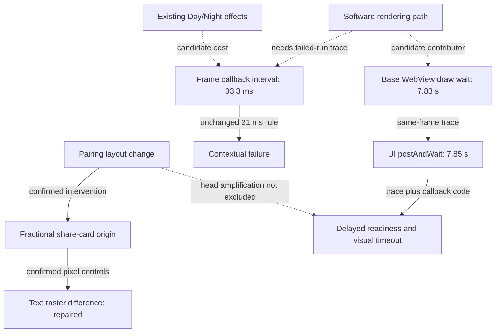

# PR #342 causal graph

Audit subject: `0eeee89db2d7704bde7bc7c84c72b213ca0f5077`; exact base:
`5b01276b99db719cae2fc72f29d38eb00c9953f4`. Initial remote head matched;
PR was open, draft and unmerged. Current-head observations and historical
mechanism evidence are kept separate below. No product or threshold changes.

Solid edges have controlled-change, code or trace support within their stated
scope. Dotted edges remain hypotheses. Android durations belong to the historical
immutable base trace, not the current-head launch. The graph does not establish
one root cause for all three test families.

## Evidence and competing explanations

| Finding | Strongest supported claim | Evidence | Missing discriminator |
| --- | --- | --- | --- |
| CG-01 share raster | Confirmed cause: changed fractional crop origin changes text rasterization | Six actual base/head crop pairs became pixel-equal after symmetric origin alignment; genuine-change controls still fail | None for this bounded capture defect |
| CG-02 menu heights | Intentional pairing layout difference, separately inspected | Four exact dimensions; current Visual run 34096851701 passed existing bindings | No release or human-approval inference |
| CG-03 Contextual | Confirmed contract failure; internal bottleneck not yet identified | Current run 34096851489, Day 33.3 ms, 18 samples; all 46 previously observed contextual resource paths matched base | Main-thread work versus compositor/raster delay in the same failing sample window |
| CG-04 Android | Confirmed historical render wait blocks UI; underlying work still ambiguous | Base trace c6ff75f2f35407c5c417a3d60d26b8c733561dae6632f6644911b4339ce639bc from run 34085557929; drawGl 7833.854 ms, UI wait 7847.235 ms | Work inside WebView/emulator graphics path and independent effect of added head precache |
| CG-05 surface hints | Neither tested hint establishes a repair | Back faces 7/8 versus 8/8; isolation 6/8 versus 5/8; both original gates failed | These candidates are rejected, not retained as optimizations |

Visual pixel thresholds, all 251 reviewed content bindings, Contextual assertions,
Android runtime and native deadlines are unchanged. Source-identical entry files
do not alone exclude indirect load from a changed dependency; the network-path
identity controls and pinned delivery checks provide separate evidence.

## Discriminating trace

`scripts/trace-contextual-cause.mjs` imports the original gate prefix and adds
only two User Timing marks around its unchanged 18-sample loop. Removing those
insertions must reproduce the original functions exactly. The original cold
launch order and every scene assertion are retained. The diagnostic drains its
HTTP server pipes and records that difference explicitly.

A browser-level Chromium trace records task, layout, raster, software compositor,
frame and thread-CPU events. Sample boundary marks bind analysis to the same
page/thread and time interval. Reports retain all raw samples, original/derived/
probe hashes, full source diff, renderer metadata, trace hash, buffer telemetry
and completion/data-loss status. Missing samples, marks or trace fail collection.
Nested trace categories must not be summed as independent work.

Local collector validation on Chromium 140 obtained both original scene samples
at 16.7 ms. It exposed substantial SoftwareRenderer work while animation-frame
callbacks themselves were short. That is a local passing run with trace overhead,
not proof of the CI failure cause. A separate CI trace runs only after the original
certification fails, whose red result is preserved. No optical ablation, timing
waiver, main-thread/compositor metric substitution, merge or deployment is made.
