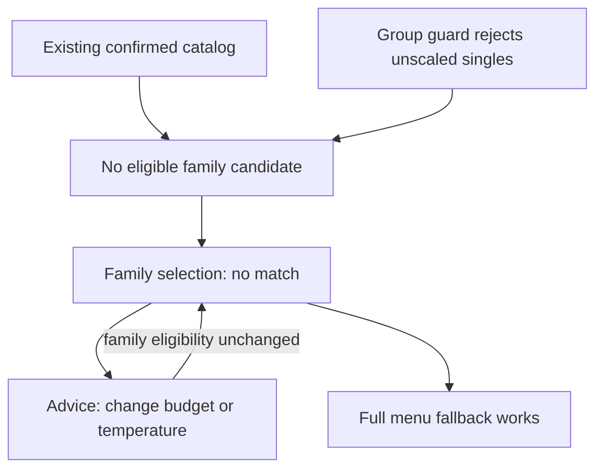

# PR #342 multi-angle mechanics review

Reviewed subject: `d794605c99f5bc7d002506e975da72bcf580c829`.
Exact base: `5b01276b99db719cae2fc72f29d38eb00c9953f4`.
Date: 2026-09-07. PR is open, draft and unmerged.

**The complete problem is not repaired.** The attributable share-origin repair
still stands. Current ordinary CI passes, but the pinned Android base fails.
The broader mechanics review also confirms that the family selection has no
eligible recommendation anywhere in the finite UI-answer space. These are
different mechanisms and must not be combined into one presumed rendering bug.

The review used two perspectives: attempt to disprove each causal assertion,
then follow actual customer actions through their visible result. These are this
assistant's checks, not independently executed Claude, Vopus or Fable reviews.

## Current CI and exact execution subjects

| Check on d794605 | Result | Evidence boundary |
| --- | --- | --- |
| [Pairing regression](https://github.com/safal207/robys-coffee-house-demo/actions/runs/34131229554) | PASS, 24/24 | Real pairing selection, quantities, totals, reload and layout checks |
| [Visual regression](https://github.com/safal207/robys-coffee-house-demo/actions/runs/34131229620) | PASS | UI/UX matrix: 24 scenarios, zero recovered failures; existing allowances only |
| [Contextual certification](https://github.com/safal207/robys-coffee-house-demo/actions/runs/34131229551) | PASS | Day 1265.1 ms, Night 1702.4 ms, warm 702.1 ms; routing and offline checks also pass |
| [Original Android smoke](https://github.com/safal207/robys-coffee-house-demo/actions/runs/34131229566) | PASS | Trigger is this head; public web content is not an immutable head delivery |
| [Pinned Android comparison](https://github.com/safal207/robys-coffee-house-demo/actions/runs/34131229568) | Base FAIL; actual head PASS | Both delivery identities pass; base reaches WEB_READY_TIMEOUT and VISUAL_STATE_TIMEOUT |
| [Unified order](https://github.com/safal207/robys-coffee-house-demo/actions/runs/34131229556) | PASS | Current browser journey job passes |

Pinned jobs are 101771583736 (base) and 101771583455 (head). The base log records
NATIVE_SURFACE at 14:13:13.827, LOAD_COMMIT_SLOW at 14:13:22.169, WEB_COMMITTED at
14:13:28.951, WEB_READY_TIMEOUT at 14:13:35.786 and VISUAL_STATE_TIMEOUT at
14:13:41.641. This is a new failure without the pairing change, not a newly
measured internal draw duration. No new Android binary trace was downloaded.

The additional recording-observer and render-trace workflow failures cannot be
attributed to this head from their trigger alone: those jobs execute frozen
historical subjects. The existing [causal graph](pr342-causal-graph-2026-09-07.md)
retains their identities and the prior actual failing traces. A green short
Contextual sample does not establish removal of the documented CPU bottleneck.

## Mechanism findings

### MA-01: family selection is an inherited dead end

The current engine was bundled without modification and evaluated over all
5 intents x 3 temperatures x 3 tastes x 3 party sizes x 4 budgets x 3 languages:
1620 combinations. This is finite domain enumeration, not 1620 browser sessions
or observed customers.

| Party size, per language | Recommendations | No match | Total combinations |
| --- | --- | --- | --- |
| One | 168 | 12 | 180 |
| Two | 72 | 108 | 180 |
| Family | 0 | 180 | 180 |

Every returned top option stays within the budget; economy options are cheaper
than the top; above-budget options are explicitly premium. All returned options
are confirmed and available and map to the exact shared-order SKU and price.
No single unscaled item is admitted as a group recommendation. These invariants
pass across all 1620 combinations; they do not turn the 900 no-match outcomes
into successful recommendations.

Six fresh browser contexts reproduce the family case, twice in each language:
coffee, hot, sweet, family, up to 600 TRY. The screen suggests changing budget
or temperature. Its change-answers action opens the budget step; changing to
Flexible returns the same no-match screen. The full-menu link works. Therefore
this is a recommendation/assistance gap, not a JavaScript crash or a broken link.

The relevant 11 source/runtime/catalog files are byte-identical to exact base
5b01276, including page, cart, engine, catalog, cart domain and shared order.
Pairing did not introduce this deterministic eligibility gap.

Smallest safe product follow-up: disclose the absence of a verified family
selection at the party-size step and offer the working full menu immediately.
That repairs the misleading recovery loop, not family recommendation support.
Actual family support needs explicit quantities, catalog-backed prices and a
total-budget contract; removing the party-size guard would be unsafe and wrong.

### MA-02: the suspected budget exclusion is disproved

The 400 and 600 UI budget definitions contain `minMinor`. Reading only those
definitions suggested an exclusion bug. The actual engine uses that value in
ranking, not the hard eligibility filter. Eight real browser runs, two fresh
contexts for each of 250/400/600/Flexible, all produce Caramel Latte at 200 TRY
and successfully add it to the shared order. No budget patch is justified.

### MA-03: configured and ordinary orders remain distinct

Three browser journeys, one per language, choose coffee/cold/sweet/two/400 and
select the 370 TRY pairing. Switching to a hot Latte and adding a second Latte
produces 550 TRY. Declining the optional macaron preserves that amount. The
selection-sharing draft includes 550; it was inspected locally, never sent.

The shared order retains both modifications and the price after reload. Adding
the ordinary 370 TRY pairing from the menu creates a separate line: total
920 TRY. Escape returns focus to the order trigger. These actions all pass.

The existing unified-order browser suite was also rerun: 20/20 checks pass,
covering all three languages, cross-route persistence, quantity/remove/undo,
back/forward, storage denial, malformed state, explicit legacy import, 320 px
large-text layout and desktop layout. Browser page-error checks are empty.

### MA-04: bounded catalog and localization inconsistencies remain

Cool Lime + Macaron is publicly orderable at 290 TRY while Smart Choice marks
the same offer provisional and unavailable, with reason
`offer-price-exceeds-components-without-declared-extra-value`. Both definitions
already exist in base. Passing the pairing flow proves its displayed price and
cart transfer, not business approval of the offer. Separate open PR #344 already
addresses offer eligibility but remains draft pending integration; its changes
are not integrated or accepted by this review.

The Smart Choice skip link retains the Turkish text `İçeriğe geç` in the Russian
capture. Its HTML lacks `data-static-copy`, the translation hook used by the
page. The primary tested flow is localized, but full accessibility localization
cannot be certified. This inherited copy issue does not explain CI timing.

## Diagnostic repair and security review

CodeQL comment 3946430066 identifies the predictable shared default file
`/tmp/robys-entry-probe.json` in `scripts/probe-entry-render-load.mjs`.
The repair creates an atomic private temporary directory with `mkdtempSync`,
writes `results.json` there and prints its location. An explicit caller-supplied
`ENTRY_PROBE_OUTPUT` remains supported. Documentation examples use the safe
default. The private directory was verified as mode 0700 and a real probe run
retained all six result records. Its exploratory 50-frame timings are not
certification evidence or proof of an animation repair.

CodeQL comment 3944353781 targets the JSON diagnostic writer in
`scripts/contextual-entry-smoke.mjs`. Manual inspection finds an intentional
data-only artifact write: the destination is a fixed filename below the
caller-configured results directory; HTTP status/error observations become JSON
data, not an executable file or a response-selected path. No product repair or
suppression is justified from the visible comment and source. The full SARIF
trace was not retrieved, so this is a bounded manual disposition, not a claimed
CodeQL clearance. Neither alert was dismissed through GitHub.

The PR reviews endpoint contains two historical COMMENTED bot reviews and no
approval. Current inline comments were read directly. No real external-model
review, human approval, merge or deployment is claimed.

## Coverage and remaining boundaries

| Perspective | Evidence and limit |
| --- | --- |
| Function | Exhaustive domain answers plus actual result-to-order actions; family gap remains |
| State and recovery | Reload, back/forward, storage denial, migration, undo and focus return pass; family advice does not recover |
| UX and accessibility | Existing 24-case CI UI/UX matrix plus local 320 px large text; no physical-device or full screen-reader certification |
| Localization | Three-language journeys pass; untranslated skip-link text remains |
| Performance | Current CI versus previous actual failing traces; no new safe render repair established |
| Security and authority | Private diagnostic output repaired; fixed JSON artifact manually inspected; no credentials, messages or purchase actions |
| Repository and CI | Head/base/actual Android delivery separated; current metadata is open/draft/unmerged |
| Causality | Budget counterexample rejected; family eligibility attributed to unchanged base; render causes kept separate |
| Replay and regression | Helpers, raw observations, screenshots, source hashes and checksum manifest retained |
| Product impact | A family user can complete five questions without any possible recommendation; no conversion-loss estimate inferred |
| Evidence completeness | Browser observations and CI log excerpts identified separately; no universal or deployed-state guarantee |

## Validation and evidence

After the diagnostic repair:

- `npm run check` passes.
- `npm run verify:security` passes: 287 contracts and secret scan.
- All 251 existing visual content bindings match exactly.
- Product/runtime files, generated files, integrity manifest, original samplers,
  thresholds and Android deadlines are unchanged.

Replay archive: `pr342-multi-angle-evidence-2026-09-07.zip`, 2687998 bytes,
48 manifest-bound files, SHA-256:

`a1278e357d137a03454b01196f00ea7c65836360d3692b493b3ec4960541933a`

The archive was reopened; each member's size and SHA-256 were independently
checked. Its `observationVerified` flags certify reproduction, including the
family defect, not success of every product path. `budget-before` means the
first unchanged-head hypothesis capture; no subsequent budget patch exists.

Keep PR #342 draft. Retain the proven share-origin repair and the bounded
diagnostic-output fix. The next product change should remove the family recovery
loop at the party-size step with three-language browser coverage. Contextual CPU
cost and Android's internal render wait still require their separate repairs;
passing retries or relaxed limits cannot substitute for those repairs.
