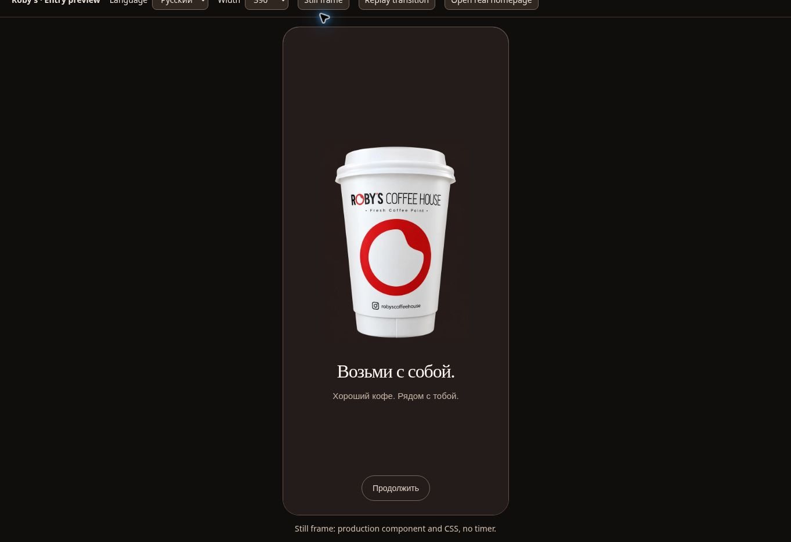
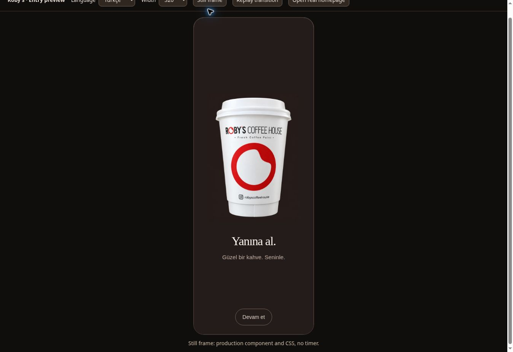
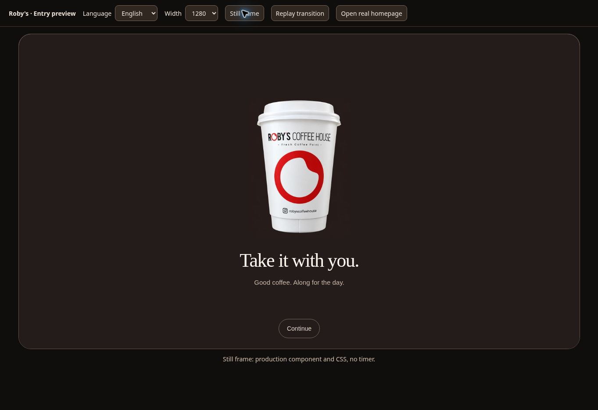

# Calm takeaway entry — 7 September 2026

The owner asked to replace the abrupt, layered entry with a relaxing scene of a
real Roby's takeaway cup, “Возьми с собой”, and a small tactile response. The cup
reference was supplied by the owner in this task.

## Change and boundaries

- One shared scene for morning, day and night. White takeaway cup, real brand
  reference, warm espresso background, gentle 10 px entrance and stationary
  opacity exit. No carousel, spinning object, zooming exit, or moving ribbons.
- Russian “Возьми с собой.”, Turkish “Yanına al.”, English “Take it with you.”
  follows the existing saved site language.
- Cold timing: 1050 ms from decoded image to handoff plus 480 ms dissolve.
  Warm timing: 350 + 250 ms. No mandatory minimum before tapping to continue.
- Failed image decode releases the page; stalled image decode is bounded at
  600 ms. A separate 2300 ms scene stop and existing 2800 ms import recovery
  protect navigation. JavaScript timers are not a real-time scheduling guarantee.
- Reduced motion and back/forward routing continue to bypass the bootstrap
  scene; Tab, Escape, visibility changes and pagehide release a running scene.
- Haptics: at most one 8 ms `navigator.vibrate` call after browser-reported user
  activation, including a tap on the scene. Unsupported/denied vibration is
  optional. No physical vibration or iOS support claim; no Android APK rebuild.
- Homepage, menu and discover use the same entry. Smart Choice and the native
  Android atomic-handoff path retain their existing routing.
- Asset: `src/brand/robys-takeaway-cup-v1.webp`, 640 × 918, 27,174 bytes. Prepared
  with the built-in image tool from the user's photograph, then resized/encoded
  with Sharp. This is a generated product rendition, not an unchanged photograph
  or a new master identity asset. The original photo is not published.
- Prompt: isolate the supplied white lidded Roby's cup, preserve printed identity
  and proportions, remove hand/table/chairs, soft studio light, no added objects
  or copy. Initial output had baked checkerboard; corrected its background to
  espresso. The final asset and matching background were inspected in-browser.
- Entry module and image are precached; build synchronizes its content hash in
  bootstrap and service worker. Integrity manifest regenerated.

## Validation

Base: `a2fbce66f716b1b99e924239d5dd118cf37c5eef` (current main when fetched).

| Check | Result |
| --- | --- |
| `npm run check` | PASS |
| `npm run verify:security` | PASS; 285 contracts, no secrets found |
| `npm run verify:entry-handoff` | PASS; active module byte hash and offline match |
| `npm run test:takeaway-entry` | PASS; 21 deterministic lifecycle tests |
| `node scripts/verify-performance-contract.mjs` | PASS; existing static budgets |
| Actual browser scene replay | loading 1 ms → decoded brand 8 ms → handoff 1059 ms → done 1620 ms |
| Mobile 390 / RU; 320 / TR; desktop 1280 / EN | Visual inspection, screenshots below |
| Actual homepage → View Menu | Browser click opened the menu after the entry |

The deterministic tests simulate lifecycle scheduling and capability failure;
they do not measure rendered FPS or physical haptics. Browser measurements above
are a single run, not a device-wide performance certification. One clipped
screenshot request timed out; full-viewport capture succeeded. The browser also
reported extension metadata errors, not attributed to application code.

## Reproduction

`npm ci`, `npm run dev`, then open `/qa/takeaway-preview.html`. Select a width
and language. “Still frame” creates the production component with its production
CSS and holds it for inspection; it is not timing evidence. “Replay transition”
runs the production lifecycle and prints event times. “Open real homepage” opens
the actual product in the selected viewport for handoff/navigation checking.

Vite is a dev dependency only, added because this static repository lacked a
development preview script. The production build/deployment architecture is
unchanged. QA fixtures are excluded from the integrity/public-artifact scope.

## Certification migration (PR #343 follow-up)

The owner approved continuing the CI corrections after reviewing the draft.
The original PR head `15bdf8818d828fbf46a519c83e3740839d963670` failed four
motion jobs because they waited for retired spline selectors. The following
migration makes the new visual requirements explicit; old geometry is neither
faked with aliases nor silently accepted as evidence for the cup.

| Previous expectation | Takeaway-v1 requirement | Retained protection |
| --- | --- | --- |
| 20 logical spline poses, red surface | Actual 10 px cup entrance sampled from its first animation frame | 24 frames, ≥20 distinct transforms and changes, ≤2 identical consecutive frames, median ≤20.5 ms |
| Separate Day/Night palettes and durations | Same warm espresso scene at every time of day | Routing boundaries, forced overrides and session continuity across all three scenes |
| Layered 3D depth, foreground blur, canonical SVG reveal | Reviewed 640×918 cup fingerprint, no blur, no occlusion, readable stationary hold ≥250 ms | Sharp focal artwork before exit; opacity ≥.999; overlay ≥.98; exit not started during hold |
| Seven compositor animations | At most two animations, transform/opacity only | No animated filter/layout properties; stationary, monotonic exit dissolve |
| Decorative overlay with no controls | One named 44 px skip button | No autofocus/inert body; Tab/Escape immediately release the page; no focus trap |
| Cold/warm total release windows | Cold 1100–2400 ms; warm 400–1100 ms | Same release windows; scene-independent 1050/350 ms hold, with bounded decode |
| Offline Day/Night module | Offline takeaway module and decoded branded cup | Real installed/activated service-worker test and normal post-entry cleanup |

The browser suite also gates ≥4.5:1 text contrast, viewport containment at
320/390/1280 px and short landscape, actual menu navigation, image failure and
stalled decode without late resurrection, slow/failed imports, dynamic reduced
motion, and background recovery. The 21 deterministic lifecycle tests retain
haptic capability, single-pulse, animation failure and hard-stop coverage.

The QA selector values now resolve through literal allowlists and URLSearchParams
before assigning the iframe URL, addressing the CodeQL finding without reproducing
an exploit. Its iframe uses an outline so advertised widths equal content widths.

The original visual screenshot job recovered to 43/43 zero-diff comparisons on
its existing automatic second attempt; its final failure was the old Morning
selector. Screenshot thresholds and retry policy were not changed.

The original native Android job recorded WEB_READY_TIMEOUT followed by
VISUAL_STATE_TIMEOUT. That job loads the mutable public GitHub Pages deployment
(`web_bytes_pinned_to_pr=false`), so it does not certify this PR's web bytes.
Native deadlines, terminal-failure checks and permissions remain unchanged.
Current-head CI results must be read separately; a local syntax check is not a
browser or emulator pass. Recheck CI and review on each new head before merge.
The live site has not been deployed from this task.

## Keyboard dismissal review follow-up

Codex reviewed head `69f10aab5853b2e19e0e9fe957e2725addc0504e` and found that
Tab/Escape skipped the session marker. Accepted finding:
https://github.com/safal207/robys-coffee-house-demo/pull/343#discussion_r3949681059.

Explicit keyboard dismissal now records the entry as seen before releasing the
page. The next navigation in that tab uses the short warm variant. Generic
cleanup remains separate: failed/stalled image loading does not mark a successful
entry. Unavailable session storage still cannot block keyboard dismissal.

The regression test failed for both keys before the fix (19/21 passing) and
passed after it (21/21). The browser release certification now starts each key
case in a fresh context, checks cold dismissal and then warm navigation across
scenes. Previously, those cases reused a session already warmed by natural
completion and could conceal this defect. Current-head browser results are
reported by CI separately from the deterministic local tests.

## Screenshots

