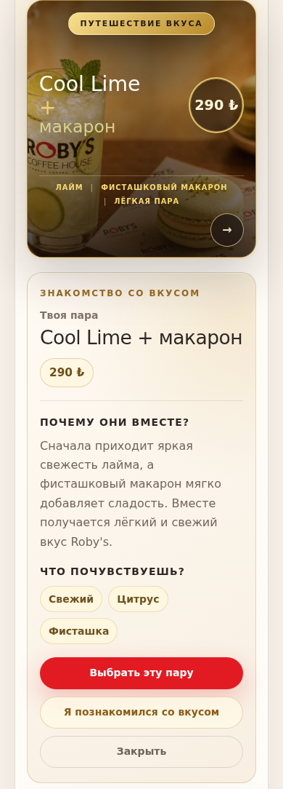

# Roby's: review of inline pairing details

The mobile pairing details now follow the selected poster. Secondary actions
reuse the site's base button styling; the title, price, notes and all three
actions reflow when text is enlarged. Catalog prices and the ordering flow are
unchanged.

This is a focused design/product review of `menu.html#pairing-offers`, based on
the owner's uploaded mobile screenshot, source inspection and local Chromium
rendering. The source starts at PR #426 commit
`931d48701314faed480f7e88cad1439ccd9dadf3`. The screenshot alone does not identify
the owner's deployed revision or prove the cause of its missing special styles.

## Findings and disposition

| ID | Evidence and consequence | Disposition |
| --- | --- | --- |
| WD-001 | The uploaded screenshot shows a poster title behind its circular price. Part of the pairing name is unreadable. | PR #426 already separates title and price; those fixes are preserved and retested. |
| WD-002 | Details for Cool Lime, 290 lira, follow the other poster, San Sebastian, 370 lira. Source appended details after both posters. This creates a misleading visual association. | At up to 900 CSS px, details follow the selected card. At 901 px and above, both posters precede the full-width details. Resizing retains the focused detail action. |
| WD-003 | The uploaded screenshot shows native grey secondary buttons and joined tasting notes. The two secondary actions had no shared `.button` class. | Both actions reuse `.button` and `.button-light`; the specialized styles retain distinct primary, progress and close roles. Notes have separate wrapping pills and whitespace between DOM spans as a readable fallback. Asset/cache revisions are rebuilt. |
| WD-004 | Enlarged RU/TR text exposed intrinsic-width overflow in the detail grid and in the lower booking action grid. | Explicit shrinkable grid tracks, wrapping text and bounded children keep the page within 320 CSS px at 200% root text. |

These are local task/comprehension findings, assessed as moderate (P2), with
high confidence in the visible/code evidence. They are not measured losses in
sales or a whole-site accessibility certification.

## Designer review

The cream, dark coffee and red brand colors are retained. The detail title is
more compact, body copy uses 16 px at the default root size, and recurring
labels, notes and action text use 14 px. Actions have at least 44 px height,
separate spacing and a keyboard focus ring. At 200% text, the panel grows
vertically instead of clipping its content.

## Product review

The decision sequence is now coherent: selected pairing, matching price,
explanation, tasting notes, then the primary choice. Choosing a pair opens its
matching product draft; reading or closing details does not add an order.

Two questions remain product hypotheses, not defects established by analytics:

- Can a visitor name both items and explain whether the displayed amount is
  the price for the pair? Check this with five visitors before changing copy.
- Do visitors understand that the progress action records familiarity with
  the description? Observe how they explain the action and compare primary
  choice, progress and dismissal behavior before removing or renaming it.

## Verification and limits

The local browser report passed 241 checks with zero failures. It includes
72 open-detail states: two pairings, three languages, six widths
(320/390/768/900/901/1440 CSS px) and 100%/200% root text. It also checks resize
focus, native/fallback product flows and a stylesheet-failure fallback: the
secondary actions remain rounded brand buttons of at least 44 px height.

The unchanged visual comparator passed 43/43 comparisons against PR #426's
exact source. Its first attempt passed 42/43 because an unchanged Discover-page
thumbnail was absent from one capture. One unchanged repeat captured that
thumbnail and passed; both attempts are preserved. No exception record,
threshold, workflow or comparator was changed. Previous main-to-PR #426 visual
dispositions remain historical evidence for that earlier change.

`npm run check`, `npm run verify:security` and `git diff --check` passed.
The security suite ran 353 contracts and its secret scan. See
[the source-bound verification summary](pairing-inline-layout-results-20261006.json).

Source/generated parity, stylesheet/script revisions, service-worker cache
revision and integrity evidence are refreshed through the declared build.
This review does not cover real purchases, assistive technology, device-native
Safari, analytics or publication. Local assistant checks and independent
subagent inspection are not independent human approval.
